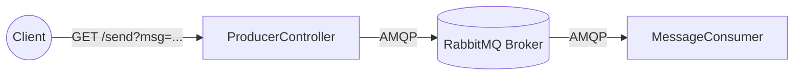

# RabbitMQ Queue Demo

This project demonstrates a simple integration between a Spring Boot application and a RabbitMQ message broker. It uses Docker Compose to run both the Spring Boot backend and the RabbitMQ server.

## High-Level Design (HLD)

### Architecture Overview

The system consists of three main components:
1. **Producer Side (REST API)**: Exposes an HTTP endpoint to accept user messages.
2. **Message Broker (RabbitMQ)**: A persistent message queue that receives messages from the producer and holds them until a consumer is ready.
3. **Consumer Side (Listener)**: A background worker that constantly listens to the queue, processes incoming messages, and executes business logic.

### Component Details

1. **`ProducerController` (Producer)**:
   - Contains a REST endpoint `/send`.
   - Takes a `msg` query parameter.
   - Uses Spring's `RabbitTemplate` to push the submitted message directly to `my_learning_queue`.

2. **`RabbitConfig` (Queue Configuration)**:
   - Tells RabbitMQ to ensure the queue `my_learning_queue` exists upon startup.
   - Sets the queue as **durable** (`true`), meaning the queue (and its messages, if made persistent) survives a RabbitMQ broker restart.

3. **`MessageConsumer` (Consumer)**:
   - Acts as a background listener using the `@RabbitListener` annotation.
   - Subscribed directly to `my_learning_queue`.
   - Triggers automatically and executes its internal logic (like printing the message to the console) the moment a new message lands in the queue.

4. **Docker Setup (`docker-compose.yml`)**:
   - **`rabbitmq` service**: Pulls the official `rabbitmq:4.0-management` image. It sets up credentials and exposes port `5672` for AMQP communication and `15672` for the Management UI.
   - **`java-app` service**: Builds the Spring Boot application locally using a multi-stage `Dockerfile` and runs the resulting `.jar`. It connects to the RabbitMQ service using the internal Docker network.

### Complete Execution Flow
1. A user triggers a web request: `http://localhost:8080/send?msg=Hello`
2. The `ProducerController` receives `Hello` and hands it over to the Spring `RabbitTemplate`.
3. `RabbitTemplate` serializes the message and sends it via AMQP to `my_learning_queue` inside the RabbitMQ container.
4. RabbitMQ safely stores the message in the queue.
5. The `MessageConsumer`, which maintains an open, long-lived connection, is immediately notified of the new message.
6. The consumer pulls the message and seamlessly processes it.